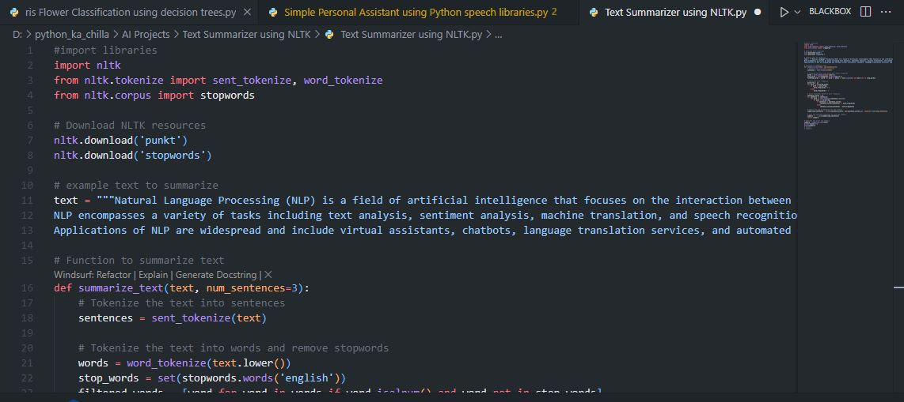
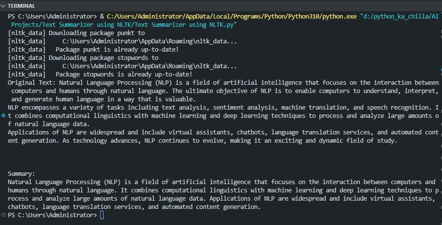

# 📝 Text Summarizer using NLTK 🤖  
   

<p align="center">
  
</p>

🚀 This project implements a simple **extractive text summarizer** using the Natural Language Toolkit (NLTK). It analyzes a given text, tokenizes sentences, removes stopwords, calculates word frequencies, and scores each sentence based on the frequency of its words. The top-scoring sentences are then combined to form a concise summary. Perfect for learning NLP fundamentals and automatic summarization techniques.

---

## ✨ Key Features  
📖 **Sentence Tokenization** – Splits text into individual sentences  
🔤 **Word Tokenization** – Splits sentences into words for analysis  
🚫 **Stopword Removal** – Ignores common words (e.g., "the", "is")  
📊 **Word Frequency Calculation** – Counts occurrences of each word  
📈 **Sentence Scoring** – Ranks sentences by total word frequency  
✂️ **Extractive Summary** – Returns the top N sentences (default 3)  

---

## 🧠 Tech Stack  
- **Language:** Python 🐍  
- **Library:** NLTK (Natural Language Toolkit)  
- **Techniques:** Tokenization, Stopword Removal, Frequency Analysis  

---

## 📦 Installation  

```bash
git clone https://github.com/SayabArshad/Text-Summarizer-NLTK.git
cd Text-Summarizer-NLTK
pip install nltk
```

⚙️ Note: The first run will download necessary NLTK data packages (punkt and stopwords).

---

## ▶️ Usage

Run the main script:

```bash
python "Text Summarizer using NLTK.py"
```

The script will:

Load a sample text about NLP.

Tokenize the text into sentences and words.

Remove stopwords and compute word frequencies.

Score each sentence based on word frequency.

Print the original text followed by a 3‑sentence summary.

---

## 📁 Project Structure

```
Text-Summarizer-NLTK/
│-- Text Summarizer using NLTK.py  
│-- README.md                     
│-- assets/                         
│    ├── code.JPG
│    └── output.JPG
```
---

## 🖼️ Interface Previews

| 📝 Code Snippet | 📊 Console Output |
|:---------------:|:-----------------:|
|  |  |

---

## 💡 About the Project

Automatic text summarization is a key NLP task that reduces a document to its most important points. This project demonstrates an extractive summarization approach: it selects important sentences directly from the original text rather than generating new ones. The algorithm works by:

Tokenizing the input into sentences.

Tokenizing all words and removing stopwords.

Building a frequency dictionary of the remaining words.

Scoring each sentence as the sum of the frequencies of its constituent words.

Returning the highest‑scoring sentences as the summary.

This simple yet effective method is a great starting point for understanding more advanced summarization models like TextRank or transformer‑based approaches.

---

## 🧑‍💻 Author

**Developed by:** [Sayab Arshad Soduzai](https://github.com/SayabArshad) 👨‍💻

📅 **Version:** 1.0.0

📜 **License:** MIT License


---

## ⭐ Contributions

Contributions are welcome! Fork the repository, open issues, or submit pull requests to enhance functionality (e.g., adding TF‑IDF scoring, supporting longer documents, or building a web interface).
If you find this project helpful, please ⭐ star the repository to show your support.

---

## 📧 Contact

For queries, collaborations, or feedback, reach out at **[sayabarshad789@gmail.com](mailto:sayabarshad789@gmail.com)**

---

📝 Summarizing text, one sentence at a time.

---
